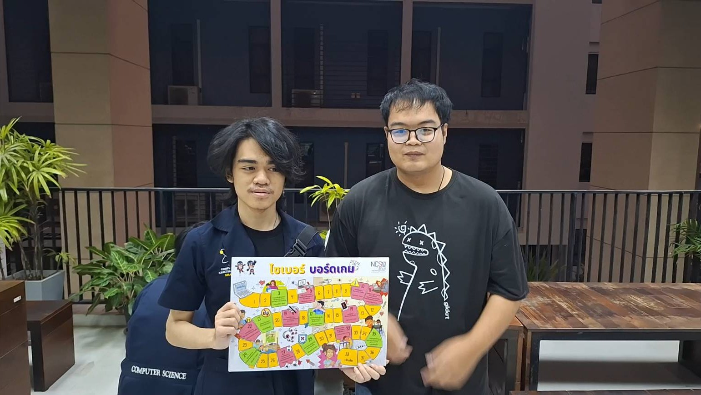
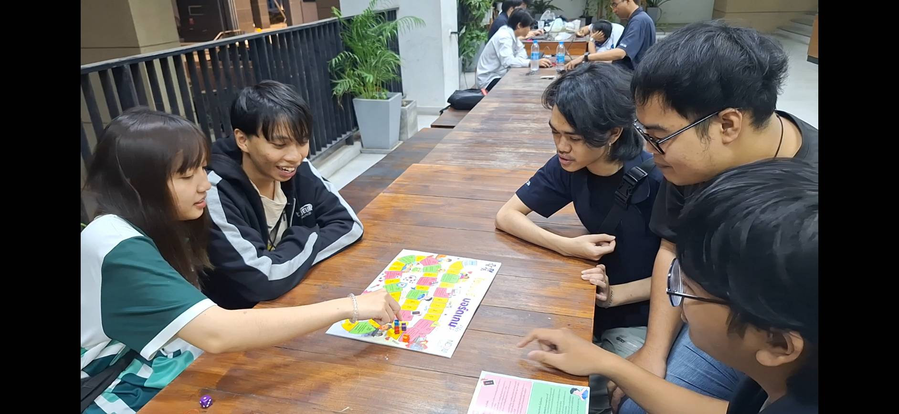
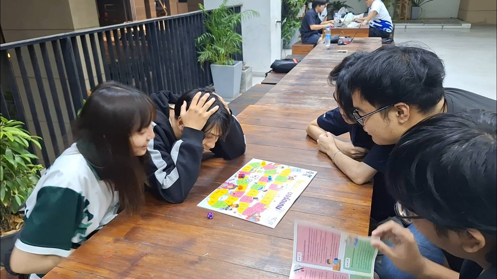
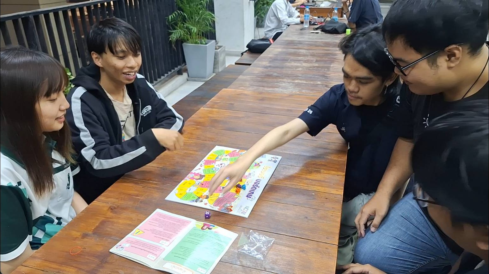
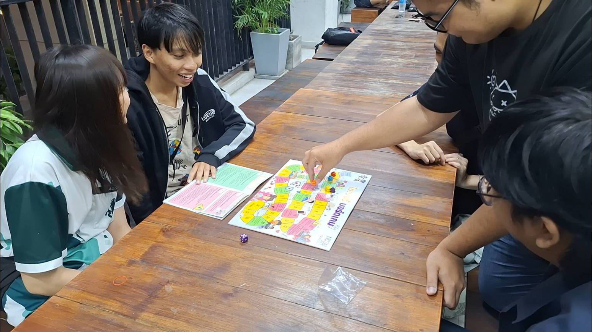

# **NCSA Boardgame Challenge – AudAud007 Team 🥷💥**  

## **🔐 Cybersecurity Awareness through Board Games**  

### **📢 Securing Human Topic in Information System Security **  
กิจกรรมนี้จัดขึ้นโดยใช้บอร์ดเกมจาก **สำนักงานคณะกรรมการการรักษาความมั่นคงปลอดภัยไซเบอร์แห่งชาติ (สกมช.)** เพื่อถ่ายทอดแนวคิดและความสำคัญของ **Cybersecurity** ให้กับผู้เข้าร่วม ผ่านการเล่นเกมที่สนุกสนานและช่วยให้เกิดการเรียนรู้แบบอินเทอร์แอคทีฟ  

---

## **📆 Date**  
🗓 **11 กุมภาพันธ์ 2025**  

📍 **Location:** ตึก 26  

🎯 **Target Audience:**  
นักศึกษาสาขาวิศวกรรมอุตสาหการและระบบ **คณะวิศวกรรมศาสตร์ ศรีราชา**  

---

## **🎲 Purpose of the activity**  
- เสริมสร้าง **ความเข้าใจด้านความปลอดภัยทางไซเบอร์** ผ่านบอร์ดเกมที่ออกแบบมาเพื่อจำลองสถานการณ์จริง  
- กระตุ้นให้ผู้เข้าร่วม **ตระหนักถึงภัยคุกคามทางไซเบอร์** และแนวทางป้องกันที่ถูกต้อง  
- ฝึกฝนทักษะการ **คิดวิเคราะห์และตัดสินใจ** ผ่านสถานการณ์ที่ต้องใช้ไหวพริบ  
- สร้างแรงบันดาลใจให้ผู้เข้าร่วม นำแนวทางการรักษาความปลอดภัยไซเบอร์ไปประยุกต์ใช้ในชีวิตประจำวัน  

---

## **📸Activity Pictures**  

  
  
  
  
  

---

## **🎥 Activity Video**  

📹 คลิกเพื่อรับชมวิดีโอ:  
  

---

## **👥 ทีมผู้จัดกิจกรรม**  

🔹 [**Kiadtiyod Hongglin (6530250026)**](https://professerswitch.github.io/boardgame)  
🔹 [**Sintana Suwannacond (6530250255)**](https://sintana11.github.io/boardgame)  
🔹 [**Chayaphol Jitnaphets (6530250352)**](https://copyyu.github.io/boardgame)  
🔹 [**Pasin Harnkham (6539250441)**](https://mater3214.github.io/boardgame)  

ขอขอบคุณทุกท่านที่เข้าร่วมและให้ความสนใจ หวังว่ากิจกรรมนี้จะเป็นประโยชน์และช่วยให้ทุกคนตระหนักถึงความสำคัญของความปลอดภัยไซเบอร์มากยิ่งขึ้น! 🙌🔐🎲  
